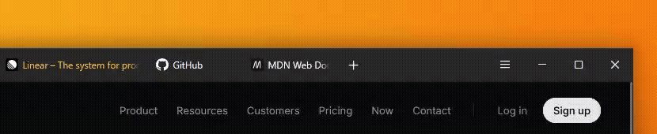

# FoxOne

**A minimalistic one-line Firefox theme**
> Ready for **Nova**. Tested and stable on Firefox 152+ with `browser.nova.enabled`
> 

 

## Installation
>
>1. Download [`userChrome.css`](https://github.com/Firnschnee/FoxOne/blob/main/userChrome.css) and [`userContent.css`](https://github.com/Firnschnee/FoxOne/blob/main/userContent.css)
>
>2. Go to **`about:config`** in FireFox. Search for **`toolkit.legacyUserProfileCustomizations.stylesheets`** and set it to **`true`**.
>
>3. Find your profile folder: In Firefox, go to `about:support` and click **Open Profile Folder**.
>
>4. Create a `chrome` folder inside your profile folder if it doesn't exist, then copy these files into it:
>
>- [`userChrome.css`](https://github.com/Firnschnee/FoxOne/blob/main/userChrome.css) — browser UI styling
>- [`userContent.css`](https://github.com/Firnschnee/FoxOne/blob/main/userContent.css) — new tab / home page colors
>
>5. Restart Firefox - The theme applies on restart.

### Features

Dynamic URL bar with hover-reveal Icons

 

Dynamic tabs and two addons pinned by the hamburger, revealed on hover.

 

 

Floating Find Bar. Adapted from [LittleFox](https://github.com/biglavis/LittleFox)

---
 
**[Installation](docs/installation.md) and [Customisation](https://github.com/Firnschnee/FoxOne/blob/main/docs/customisation.md)** |
Inspired by [Cascade](https://github.com/andreasgrafen/cascade) & [LittleFox](https://github.com/biglavis/LittleFox) | It works with [Adaptive Tab Bar Colour](https://addons.mozilla.org/de/firefox/addon/adaptive-tab-bar-colour/)! | License: [MIT](LICENSE) 
