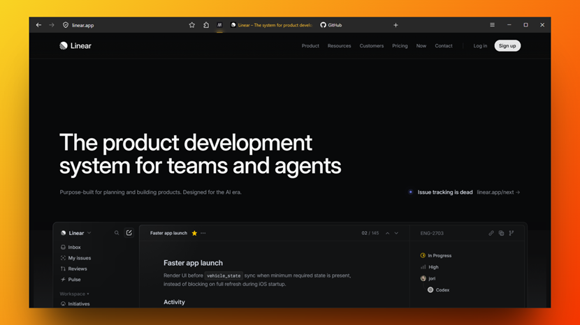

# FoxOne

**A minimalistic one-line Firefox theme.**
> **Ready for Nova. Tested and stable on Firefox 152+ with `browser.nova.enabled`**
> 

One-line layout. Clean URL bar. Hover-reveal icons. Gruvbox colors. Nothing else.

## Features

[minimalistic theme.] *description from notes.md*

**Dynamic URL**

**Dynamic toolbar support.** 

TAB SWITCH & Two extension icons of your choice, pinned by the hamburger, revealed on hover.

**plus a [Floating Find Bar](assets/findbar.gif) and more!**

It is *highly customisable* with variables & it works with [Adaptive Tab Bar Colour](https://addons.mozilla.org/firefox/addon/adaptive-tab-bar-colour/)! 

---
 
**[Installation](docs/installation.md) & [Customisation](https://github.com/Firnschnee/FoxOne/blob/main/docs/customisation.md)** |
Inspired by [Cascade](https://github.com/andreasgrafen/cascade) & [LittleFox](https://github.com/biglavis/LittleFox) | Running pre-Nova Firefox? [Please read](docs/installation.md) | License: [MIT](LICENSE) 
