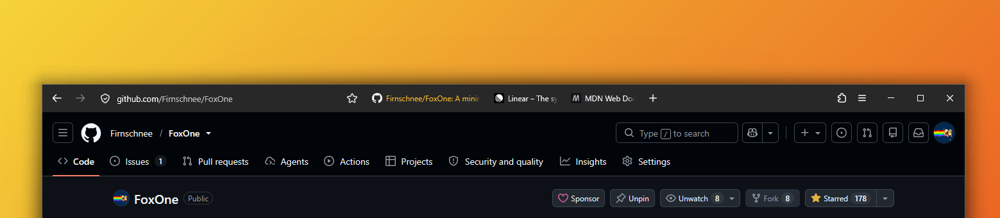

# FoxOne

One-line layout, hover-reveal icons, dynamic bookmarks bar, floating Findbar, Gruvbox colors and ready for **Nova**

> Tested on Firefox 155 with `browser.nova.enabled` and on Windows, macOS, and Linux (GNOME & KDE).
> 

Want to see it in Action? [This way](https://firnschnee.github.io/FoxOne/action.html)

_I use Firefox ESR, which release should I use?_
> - **ESR 153** (with `browser.nova.enabled`) – use **3.5.2**
> - **ESR 140** (with the classic **pre-Nova** UI) – use **2.3**

_And what about Thunderbird?_
> You are looking for [BirdOne](https://github.com/Firnschnee/BirdOne)

   
  
Special shoutout to [@NeroWolfe75](https://github.com/NeroWolfe75) for all the bug hunting & ideas!

---
**[Installation](https://firnschnee.github.io/FoxOne/installation.html) and [Customisation](https://firnschnee.github.io/FoxOne/customisation.html)** |
Inspired by [Cascade](https://github.com/andreasgrafen/cascade) & [LittleFox](https://github.com/biglavis/LittleFox) | It works with [Adaptive Tab Bar Colour](https://addons.mozilla.org/de/firefox/addon/adaptive-tab-bar-colour/) | License: [MIT](LICENSE) 

